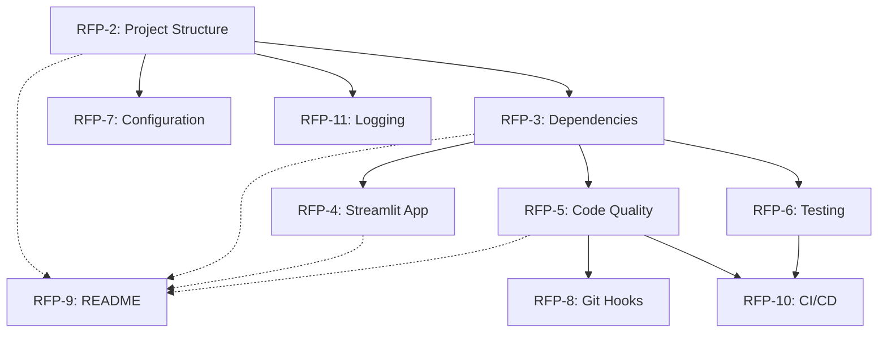

# Epic 1: Project Setup & Infrastructure

> **Status:** In Progress | **Priority:** High | **Points:** 40
> 
> **JIRA Epic:** [RFP-1](https://luis-sosa-bairesdev.atlassian.net/browse/RFP-1)
> 
> **Timeline:** Nov 11 - Nov 15, 2025 | **Owner:** Luis Sosa

---

## 📋 Executive Summary

This epic establishes the foundational project structure, development environment, and core infrastructure needed for the **RFP Draft Booster** application. It includes setting up the Streamlit application, configuring development tools, implementing project guidelines, and creating the basic UI shell.

### Quick Stats
- **Total Story Points:** 40
- **Number of Stories:** 10
- **Must-Have Stories:** 8 (32 points)
- **Should-Have Stories:** 2 (8 points)
- **Sprint:** Sprint 1 (Week 1)

---

## 🎯 Business Value

### Problem Being Solved

Before feature development can begin, we need a solid foundation with proper tooling, standards, and infrastructure to ensure consistent, high-quality code delivery.

### Expected Benefits

| Benefit | Description | Impact |
|---------|-------------|--------|
| **Faster Development** | Standardized structure accelerates feature implementation | High |
| **Code Quality** | Automated linting and formatting ensure consistency | High |
| **Collaboration** | Clear guidelines enable smooth team collaboration | Medium |
| **Maintainability** | Well-organized code easier to maintain and extend | High |

### Success Metrics

| Metric | Target | How Measured |
|--------|--------|--------------|
| **Setup Time** | < 30 minutes | Time for new developer to set up environment |
| **Code Quality Score** | > 8.0/10 | Pylint score |
| **Test Coverage** | > 80% | pytest-cov report |

---

## 📦 User Stories

### Must-Have Stories (P0) - 32 Points

#### 1. [RFP-2] Setup project repository and folder structure (5 pts)
**Status:** To Do | **Priority:** Highest

Create the foundational directory structure following BairesDev standards.

**Acceptance Criteria:**
- ✅ Repository created with standardized folder structure
- ✅ All required directories present
- ✅ .gitignore configured
- ✅ Initial README.md
- ✅ VERSION file initialized
- ✅ AI development guidelines in place

---

#### 2. [RFP-3] Configure Python virtual environment and dependencies (5 pts)
**Status:** To Do | **Priority:** Highest

Setup Python environment with all required dependencies.

**Acceptance Criteria:**
- ✅ Python 3.10+ virtual environment created
- ✅ requirements.txt with pinned versions
- ✅ All core dependencies installed
- ✅ Installation documented
- ✅ Dependencies verified

**Dependencies:** RFP-2

---

#### 3. [RFP-4] Create basic Streamlit app with navigation (8 pts)
**Status:** To Do | **Priority:** Highest

Build the basic Streamlit application shell with multi-page navigation.

**Acceptance Criteria:**
- ✅ Streamlit app runs on localhost:8501
- ✅ Multi-page structure implemented
- ✅ Navigation sidebar
- ✅ Home page with overview
- ✅ Placeholder pages for features
- ✅ Basic styling applied

**Pages:**
1. Home / Dashboard
2. Upload RFP
3. Requirements
4. Risk Analysis
5. Service Matching
6. Generate Draft

**Dependencies:** RFP-3

---

#### 4. [RFP-5] Implement code quality tools (3 pts)
**Status:** To Do | **Priority:** High

Configure automated code quality and formatting tools.

**Acceptance Criteria:**
- ✅ Black configured (line length 88)
- ✅ pylint configured
- ✅ mypy configured (strict mode)
- ✅ isort configured
- ✅ All code passes checks
- ✅ Commands documented

**Quality Gates:**
- Black: All files formatted
- pylint: Score >= 8.0/10
- mypy: No errors
- isort: All imports sorted

**Dependencies:** RFP-3

---

#### 5. [RFP-6] Setup pytest and test infrastructure (5 pts)
**Status:** To Do | **Priority:** High

Establish testing framework and infrastructure.

**Acceptance Criteria:**
- ✅ pytest installed and configured
- ✅ pytest-cov for coverage
- ✅ Test directory structure
- ✅ conftest.py with fixtures
- ✅ Sample test passing
- ✅ Coverage report (80%+ target)
- ✅ Documentation

**Test Structure:**
```
tests/
├── __init__.py
├── conftest.py
├── test_models/
├── test_services/
├── test_llm/
└── test_integration/
```

**Dependencies:** RFP-3

---

#### 6. [RFP-7] Create .env configuration for API keys (3 pts)
**Status:** To Do | **Priority:** High

Setup secure environment-based configuration management.

**Acceptance Criteria:**
- ✅ .env.example file created
- ✅ .env in .gitignore
- ✅ Configuration loader in src/config.py
- ✅ Variables validated on startup
- ✅ Clear error messages
- ✅ API key documentation
- ✅ No secrets in repository

**Required Variables:**
```bash
# LLM Configuration
GEMINI_API_KEY=
GROQ_API_KEY=

# Google Docs Export
GDOCS_CREDENTIALS_PATH=

# Application Settings
DEBUG=False
LOG_LEVEL=INFO
```

**Dependencies:** RFP-2

---

#### 7. [RFP-8] Setup Git hooks and pre-commit checks (3 pts)
**Status:** To Do | **Priority:** Medium

Implement automated pre-commit validation.

**Acceptance Criteria:**
- ✅ pre-commit framework installed
- ✅ .pre-commit-config.yaml configured
- ✅ Hooks run Black automatically
- ✅ Hooks run pylint checks
- ✅ Hooks prevent bad commits
- ✅ Documentation
- ✅ Easy team installation

**Pre-commit Hooks:**
1. Black (auto-format)
2. isort (sort imports)
3. pylint (linting)
4. trailing-whitespace
5. end-of-file-fixer
6. check-yaml
7. check-added-large-files

**Dependencies:** RFP-5

---

#### 8. [RFP-9] Create README with setup instructions (3 pts)
**Status:** To Do | **Priority:** Medium

Write comprehensive project documentation.

**Acceptance Criteria:**
- ✅ Comprehensive README.md
- ✅ Quick Start section
- ✅ Prerequisites listed
- ✅ Installation commands
- ✅ Running the app documented
- ✅ Testing commands documented
- ✅ Troubleshooting section
- ✅ Links to docs
- ✅ Setup in < 30 minutes

**README Sections:**
1. Project Overview
2. Business Value
3. Features
4. Technology Stack
5. Prerequisites
6. Quick Start
7. Usage Guide
8. Development
9. Testing
10. Documentation
11. Contributing
12. Support

**Dependencies:** All other Epic 1 stories

---

### Should-Have Stories (P1) - 8 Points

#### 9. [RFP-10] Setup CI/CD pipeline (5 pts)
**Status:** To Do | **Priority:** Medium

Implement automated CI/CD with GitHub Actions.

**Acceptance Criteria:**
- ✅ GitHub Actions workflow created
- ✅ Runs on push and PR
- ✅ Runs all tests
- ✅ Checks code quality
- ✅ Generates coverage report
- ✅ Fails if tests fail or coverage < 80%
- ✅ Status badge in README
- ✅ Documentation

**CI Pipeline Steps:**
1. Checkout code
2. Setup Python (3.10, 3.11, 3.12 matrix)
3. Install dependencies
4. Run Black (check)
5. Run isort (check)
6. Run pylint
7. Run mypy
8. Run pytest with coverage
9. Upload coverage report

**Dependencies:** RFP-5, RFP-6

---

#### 10. [RFP-11] Configure logging infrastructure (3 pts)
**Status:** To Do | **Priority:** Medium

Setup structured logging system.

**Acceptance Criteria:**
- ✅ Logging configured (DEBUG default)
- ✅ Logs to console and file
- ✅ Log rotation (daily, 30 days)
- ✅ Structured format
- ✅ Appropriate log levels
- ✅ No sensitive data logged
- ✅ Logging utility created
- ✅ All modules use logger

**Log Configuration:**
```python
# Default Level: DEBUG
# Console: INFO and above
# File: DEBUG and above
# Format: [%(asctime)s] %(levelname)s [%(name)s] %(message)s
# Rotation: 10MB per file, keep 5 files
```

**Dependencies:** RFP-2

---

## 🏗️ Technical Architecture

### Project Structure

```
rfp-draft-booster/
├── .cursor/rules/          # AI development guidelines
│   ├── domain-guidelines.mdc
│   ├── python-practices.mdc
│   ├── streamlit-guidelines.mdc
│   └── user-story-guidelines.mdc
├── .github/                # GitHub configuration
│   └── workflows/
│       └── ci.yml
├── context/                # Project configuration
│   └── context.md
├── domain/                 # Business entities
│   ├── draft-entity.md
│   ├── requirement-entity.md
│   ├── rfp-entity.md
│   ├── risk-clause-entity.md
│   └── service-catalog-entity.md
├── deliverables/           # PRDs, Epics, Stories
│   ├── prd-rfp-draft-booster.md
│   ├── epic-01-project-setup.md
│   ├── epic-02-pdf-processing.md
│   └── epic-03-llm-requirement-extraction.md
├── documentation/          # Technical documentation
│   ├── api/
│   ├── architecture/
│   ├── decisions/
│   └── deployment/
├── src/                   # Source code
│   ├── __init__.py
│   ├── main.py           # Streamlit entry point
│   ├── config.py         # Configuration management
│   ├── exceptions.py     # Custom exceptions
│   ├── models/           # Data models
│   │   ├── __init__.py
│   │   ├── draft.py
│   │   ├── requirement.py
│   │   ├── rfp.py
│   │   ├── risk.py
│   │   └── service.py
│   ├── services/         # Business logic
│   │   └── __init__.py
│   ├── llm/             # LLM integrations
│   │   └── __init__.py
│   ├── ui/              # UI components
│   │   └── __init__.py
│   └── utils/           # Utilities
│       ├── __init__.py
│       ├── logging_config.py
│       └── session.py
├── tests/                 # Test suite
│   ├── __init__.py
│   ├── conftest.py
│   ├── test_models/
│   ├── test_services/
│   ├── test_llm/
│   └── test_integration/
├── data/                  # Data storage
│   ├── uploads/          # Uploaded RFPs
│   └── temp/             # Temporary files
├── logs/                  # Application logs
├── .env                   # Environment variables (not in Git)
├── .env.example          # Environment template
├── .gitignore
├── .pre-commit-config.yaml
├── .pylintrc
├── pyproject.toml
├── pytest.ini
├── requirements.txt
├── CHANGELOG.md
├── VERSION
└── README.md
```

### Key Components

#### 1. Streamlit App Shell
- Multi-page structure with navigation
- Session state management
- Basic styling and branding

#### 2. Configuration Management
- Environment variable loading
- Validation and defaults
- Secure secret handling

#### 3. Logging System
- Structured logging to files and console
- Log rotation and retention
- Different levels for different contexts

#### 4. Testing Framework
- pytest with fixtures
- Coverage reporting
- Integration test support

### Technology Stack

| Component | Technology | Version | Purpose |
|-----------|-----------|---------|---------|
| **Language** | Python | 3.10+ | Core language |
| **Framework** | Streamlit | 1.28+ | Web UI |
| **Testing** | pytest | Latest | Unit/integration testing |
| **Coverage** | pytest-cov | Latest | Test coverage |
| **Formatting** | Black | Latest | Code formatting |
| **Linting** | pylint | Latest | Code quality |
| **Type Checking** | mypy | Latest | Static type checking |
| **Import Sorting** | isort | Latest | Import organization |
| **Pre-commit** | pre-commit | Latest | Git hooks |
| **Config** | python-dotenv | Latest | Environment variables |

---

## 📅 Timeline & Milestones

### Sprint Breakdown

**Sprint 1 (Week 1): Nov 11-15, 2025**

| Day | Milestone | Stories |
|-----|-----------|---------|
| **Day 1** | Repository & Structure | RFP-2 ✅ |
| **Day 2** | Dependencies & Tooling | RFP-3, RFP-5, RFP-7 |
| **Day 3** | Streamlit Shell | RFP-4, RFP-11 |
| **Day 4** | Testing Framework | RFP-6, RFP-8 |
| **Day 5** | Documentation & CI/CD | RFP-9, RFP-10 |

### Progress Tracking

```
█████░░░░░ 10% Complete (1/10 stories done)
```

- **Completed:** 1 story (5 points)
- **In Progress:** 0 stories
- **To Do:** 9 stories (35 points)

---

## 🔗 Dependencies

### Internal Dependencies



### External Dependencies

- **Python 3.10+** installed
- **Git** configured
- **GitHub** repository access
- **Development IDE** (VSCode, Cursor, or similar)

---

## ⚠️ Risks & Mitigation

| Risk | Probability | Impact | Mitigation Strategy |
|------|-------------|--------|---------------------|
| **Team unfamiliar with Streamlit** | Medium | Medium | Provide training resources, documentation |
| **Development environment issues** | Low | Low | Clear setup instructions, Docker option |
| **Dependency conflicts** | Low | Medium | Pin versions in requirements.txt |
| **Git hooks too restrictive** | Low | Low | Allow bypass with --no-verify, document |
| **CI/CD pipeline delays** | Medium | Low | Start early, use mock tests initially |

---

## ✅ Acceptance Criteria (Epic Level)

- [x] Project repository created with proper structure ✅
- [x] All AI development guidelines in place (.cursor/rules/) ✅
- [x] Virtual environment activates without errors
- [ ] All dependencies install successfully
- [ ] Streamlit app runs on localhost:8501
- [ ] All code passes Black, pylint, mypy checks
- [ ] pytest runs successfully (even if no tests yet)
- [ ] README instructions allow new developer to set up in < 30 minutes
- [ ] Git pre-commit hooks prevent bad commits
- [ ] CI/CD pipeline runs on every commit

---

## 📊 Progress Dashboard

### Story Status

| Status | Count | Points | Percentage |
|--------|-------|--------|------------|
| ✅ Done | 1 | 5 | 12.5% |
| 🔄 In Progress | 0 | 0 | 0% |
| 📋 To Do | 9 | 35 | 87.5% |
| **Total** | **10** | **40** | **100%** |

### Velocity Tracking

- **Planned Velocity:** 40 points/week
- **Current Velocity:** TBD
- **Forecasted Completion:** Nov 15, 2025

---

## 📝 Notes

- This epic was completed before implementation to establish AI-powered development framework
- All guidelines, templates, and domain entities created upfront
- Ready to begin feature development with solid foundation
- No blockers identified
- All team members have necessary access

---

## 🔗 Related Links

- **JIRA Epic:** [RFP-1](https://luis-sosa-bairesdev.atlassian.net/browse/RFP-1)
- **PRD:** [Product Requirements Document](../prd-rfp-draft-booster.md)
- **Repository:** [GitHub - rfp-draft-booster](https://github.com/bairesdev/rfp-draft-booster)
- **Epic Document:** [epic-01-project-setup.md](../epic-01-project-setup.md)
- **Next Epic:** [Epic 2: PDF Processing](../epic-02-pdf-processing.md)

---

## 📞 Contact & Support

- **Epic Owner:** Luis Sosa (luis.sosa@bairesdev.com)
- **Tech Lead:** TBD
- **Product Owner:** TBD
- **Slack Channel:** #rfp-draft-booster

---

**Last Updated:** 2025-11-07
**Version:** 1.0
**Status:** In Progress


